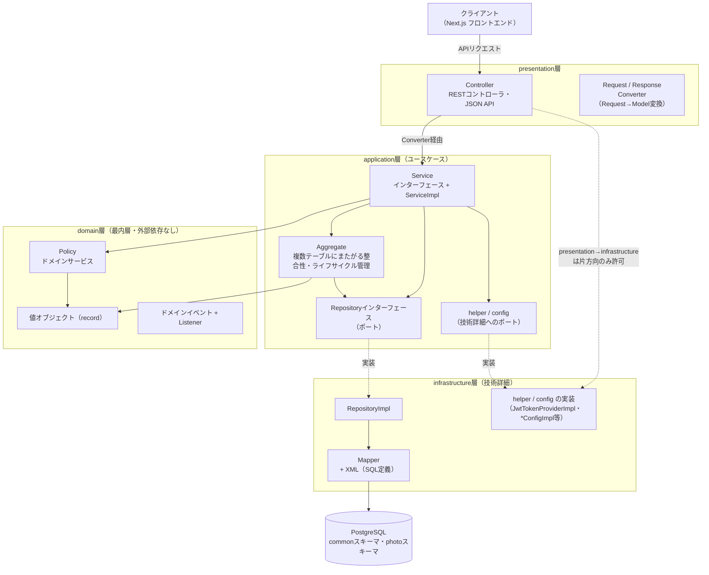
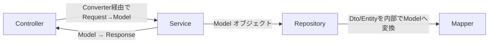

# オニオンアーキテクチャ

## 全体構成図

backendは`domain` → `application` → `infrastructure`/`presentation`の4層からなるオニオンアーキテクチャを採用しています。同心円の内側は外側を知らず、依存は常に内側へ向かいます。



## 4層の役割とパッケージ

| 層 | 役割 | 主なパッケージ |
|----|------|----------------|
| domain | 値オブジェクト・ドメインサービス（Policy）・ドメインイベント。何にも依存しない最内層 | `domain/model/{機能}/`, `domain/service/`, `domain/event/`, `domain/exception/`, `domain/enumeration/`, `domain/constant/` |
| application | ユースケース。domainのみに依存 | `application/model/{機能}/`, `application/aggregate/`, `application/service/{機能}/` (+`service/impl/{機能}/`), `application/repository/{機能}/`, `application/helper/`, `application/config/` |
| infrastructure | 永続化・セキュリティ・スケジューラ等の技術詳細。domain・applicationに依存してよい | `infrastructure/persistence/{entity,dto,mapper,repository}/{機能}/`, `infrastructure/persistence/type_handler/`, `infrastructure/scheduler/`, `infrastructure/security/`, `infrastructure/web/`, `infrastructure/helper/`, `infrastructure/config/` |
| presentation | REST API。domain・applicationに依存してよく、infrastructureにも一方向で依存できる | `presentation/controller/{機能}/`, `presentation/request/{機能}/`, `presentation/response/{機能}/`, `presentation/converter/{機能}/` |

依存方向は`backend/src/test/java/com/web/gallery/architecture/OnionArchitectureTest.java`のArchUnitテストで機械的に検証されます。

## 設計方針

### インターフェースと実装の分離

Service・Repositoryはインターフェースと実装クラスに分離しています。インターフェースはユースケースが要求するポートとしてapplication層に、実装は技術詳細としてinfrastructure層に置きます（Repositoryのみパッケージのツリー自体が異なる）。

```
application/service/photo/
└── PhotoService.java              # インターフェース
application/service/impl/photo/
└── PhotoServiceImpl.java          # 実装クラス（@Service）

application/repository/photo/
└── PhotoMstRepository.java        # インターフェース（ポート）
infrastructure/persistence/repository/photo/
└── PhotoMstRepositoryImpl.java    # 実装クラス（@Repository）
```

Service層が本来infrastructure層の技術（JWT生成、GeoIP解決、`application.yml`の設定値等）を必要とする場合も同じパターンでポート化します（`application/helper/`・`application/config/`のインターフェース、`infrastructure/security・web・config`の実装）。

### レイヤー間のデータ受け渡し

各レイヤー間では専用のオブジェクトを使用してデータを受け渡します。Modelクラス（application層）はRequest（presentation層）・Entity/Dto（infrastructure層）を直接参照せず、変換ロジックは常に外側の層に置きます。



| 区間 | 使用するオブジェクト | 変換ロジックの置き場所 |
|------|----------------------|------------------------|
| Controller → Service | Request → Model | `presentation/converter/{機能}/`の専用Converterクラス |
| Service → Controller | Model → Response | Responseクラス自身の`static from(Model)` |
| Service ↔ Repository | Model オブジェクト | - |
| Repository ↔ Mapper | Entity / Dto | Repository実装クラス内のprivateメソッド（`toXxxModel`） |

### 機能別サブパッケージ分割

`domain/model`・`application/model`・`application/service`(+`impl`)・`application/repository`・`infrastructure/persistence/{entity,dto,mapper,repository}`・`presentation/{controller,request,response,converter}`は`{account,auth,common,inquiry,photo}`の機能別サブパッケージに分かれています。クラス数が少なく分割のメリットが薄い`aggregate`・`helper`・`config`・`type_handler`・`scheduler`等はフラット構成のままです。

### 集約（Aggregate）

書き込みユースケース（登録・更新・削除）で複数テーブルにまたがる整合性・ライフサイクルの管理が必要な場合、`application/aggregate/`に集約ルートクラスを定義し、Service層とRepository層の間に位置づけます（例：`Photo`集約）。

### コード生成

Model・Entity・Dtoクラスでは**Lombok**アノテーション（`@Value`, `@Data`, `@Builder`等）を使用してボイラープレートコードを削減しています。

詳細な依存関係ルール・命名規則は`.claude/rules/architecture-overview.md`および各パッケージのルールファイル（`.claude/rules/*.md`）を参照してください。
