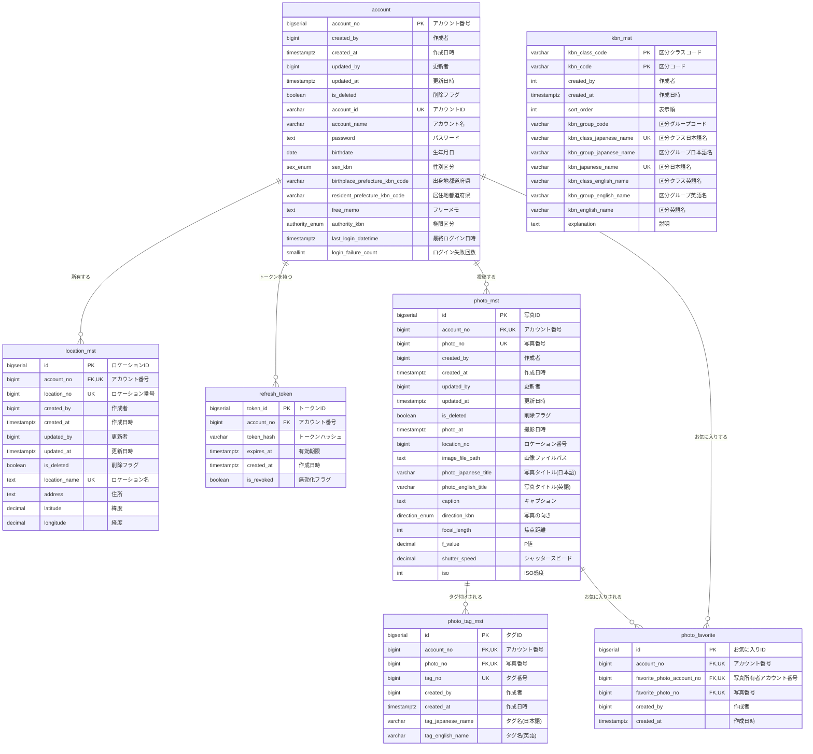
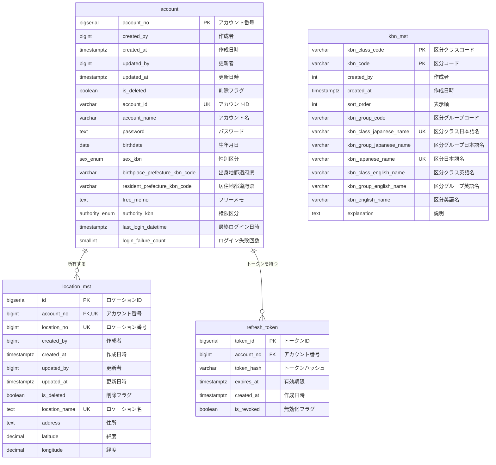
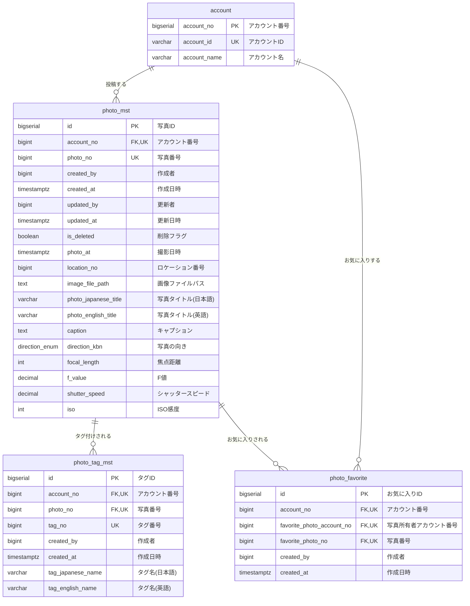

# ER図

## 全体ER図

## スキーマ別ER図

### common スキーマ

### photo スキーマ

## リレーションシップ一覧

| No | 親テーブル | 子テーブル | 外部キー | 関係 | 説明 |
|----|-----------|-----------|----------|------|------|
| 1 | common.account | common.location_mst | account_no → account_no | 1:N | アカウントが複数のロケーションを所有 |
| 2 | common.account | common.refresh_token | account_no → account_no | 1:N | アカウントが複数のリフレッシュトークンを持つ |
| 3 | common.account | photo.photo_mst | account_no → account_no | 1:N | アカウントが複数の写真を投稿 |
| 4 | common.account | photo.photo_favorite | account_no → account_no | 1:N | アカウントが複数の写真をお気に入り |
| 5 | photo.photo_mst | photo.photo_tag_mst | (account_no, photo_no) → (account_no, photo_no) | 1:N | 写真に複数のタグを付与 |
| 6 | photo.photo_mst | photo.photo_favorite | (account_no, photo_no) → (favorite_photo_account_no, favorite_photo_no) | 1:N | 写真が複数のユーザーにお気に入りされる |
