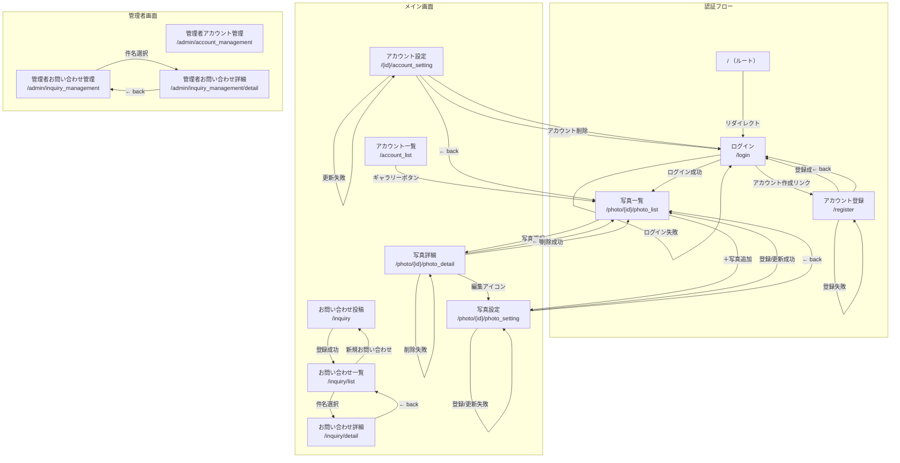
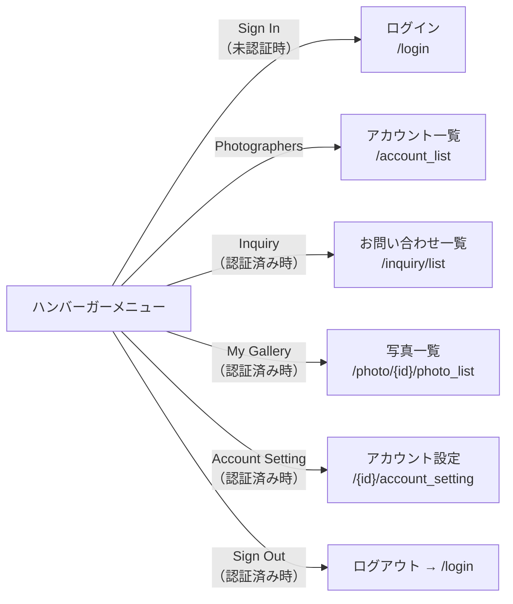
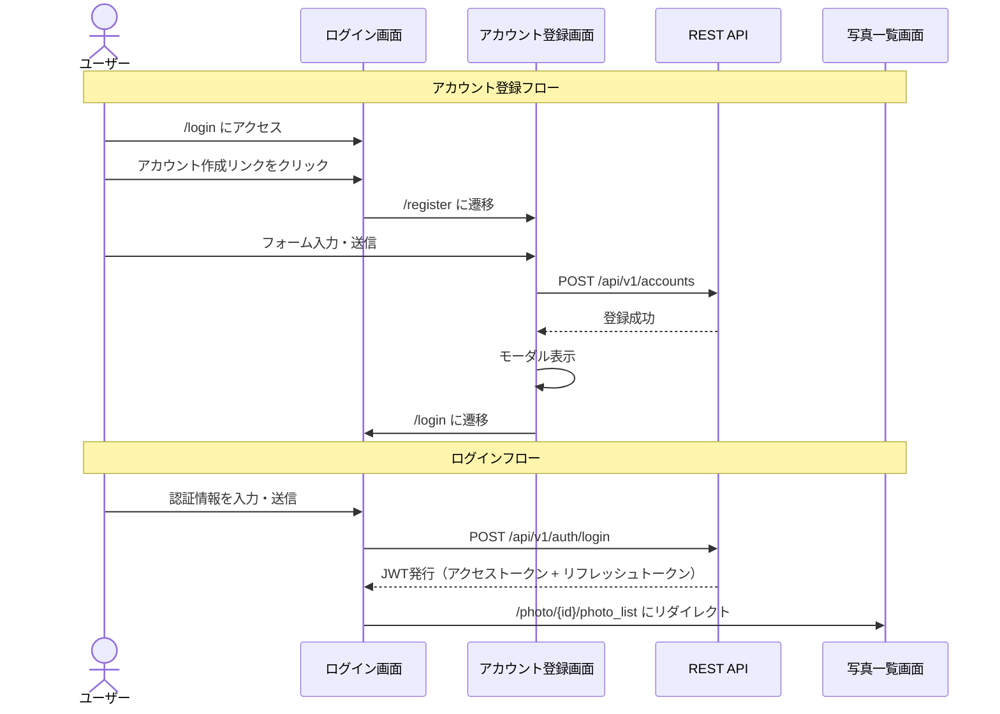
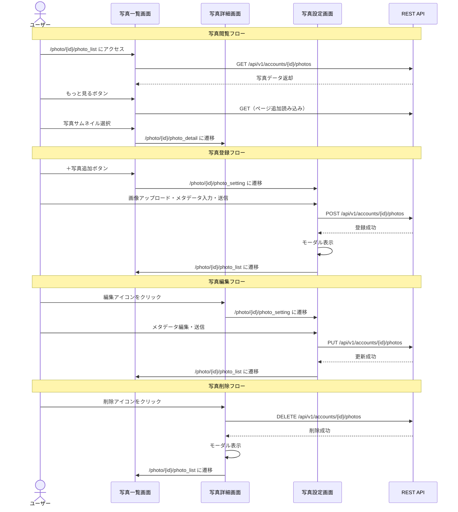
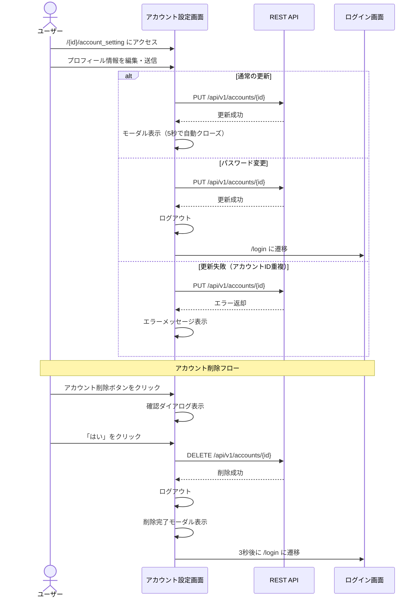
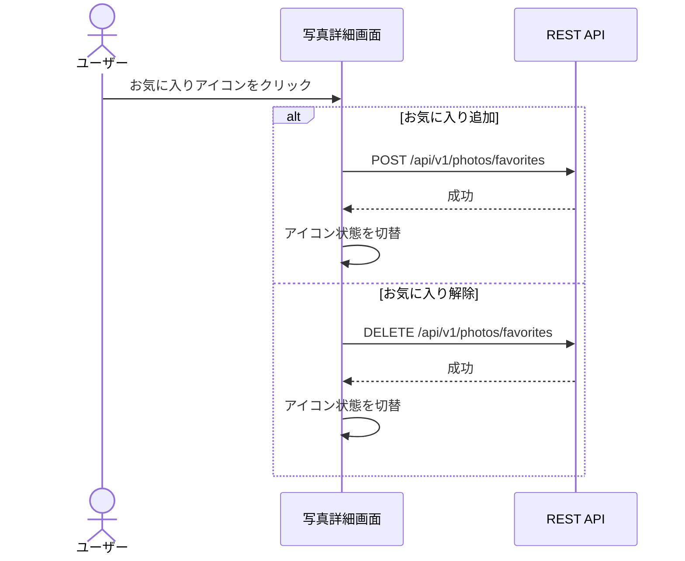
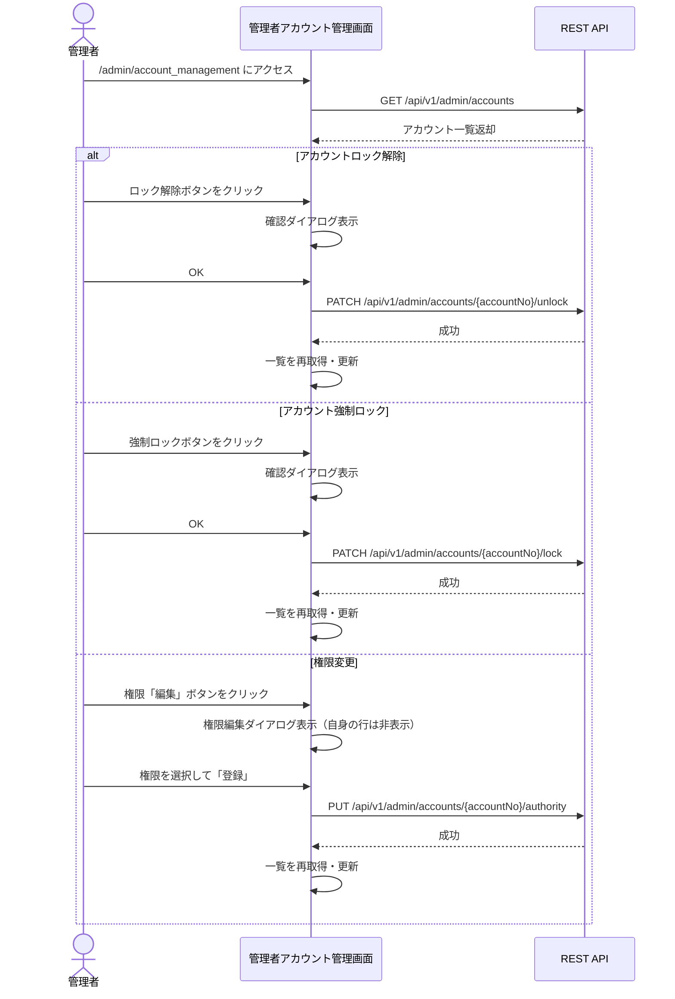
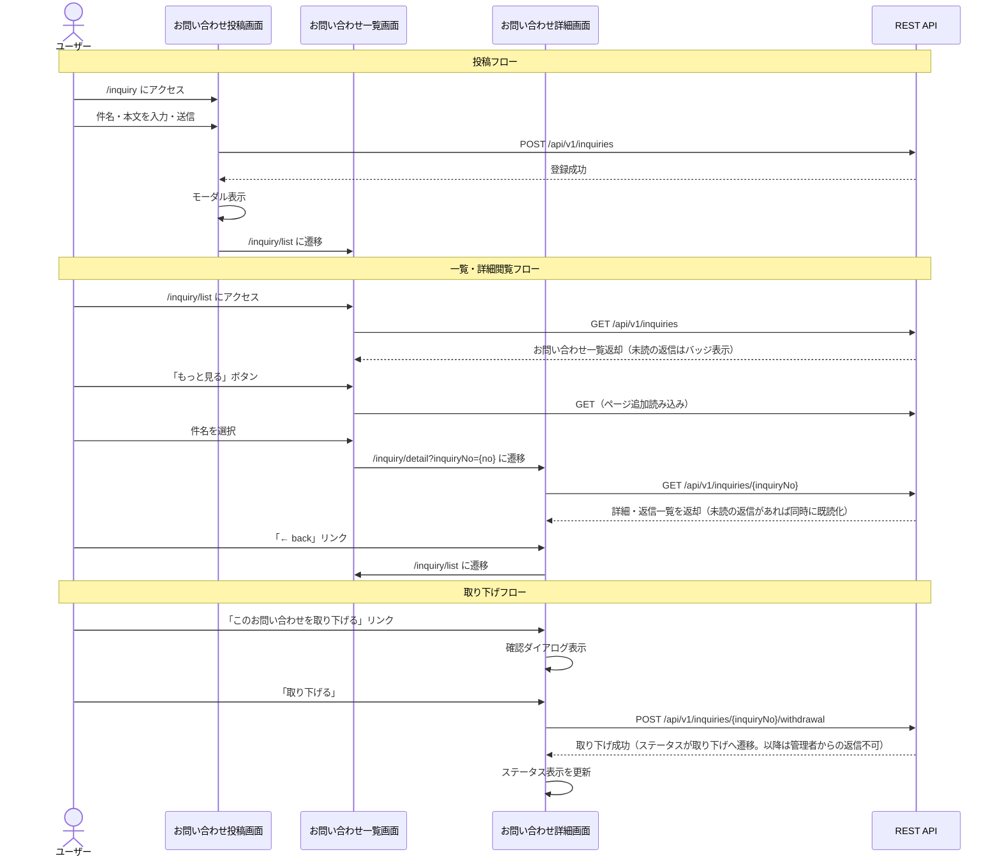
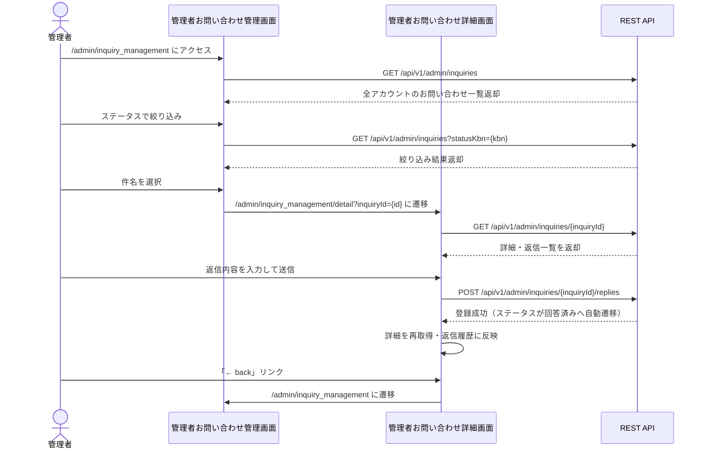

# 画面遷移図

## 画面一覧

| # | 画面名 | ビュー名 | URLパス | アクセス制御 |
|---|--------|----------|---------|-------------|
| 1 | ログイン | `login` | `/login` | 公開 |
| 2 | アカウント登録 | `account_register` | `/register` | 公開 |
| 3 | アカウント一覧 | `account_list` | `/account_list` | 公開 |
| 4 | アカウント設定 | `account_setting` | `/{accountId}/account_setting` | 認証必須（本人のみ） |
| 5 | 写真一覧 | `photo_list` | `/photo/{photoAccountId}/photo_list` | 公開 |
| 6 | 写真詳細 | `photo_detail` | `/photo/{photoAccountId}/photo_detail` | 公開 |
| 7 | 写真設定 | `photo_setting` | `/photo/{photoAccountId}/photo_setting` | 認証必須（本人のみ） |
| 8 | 管理者アカウント管理 | `admin_account_management` | `/admin/account_management` | 認証必須（管理者のみ） |
| 9 | お問い合わせ投稿 | `inquiry` | `/inquiry` | 認証必須 |
| 10 | お問い合わせ一覧 | `inquiry_list` | `/inquiry/list` | 認証必須 |
| 11 | お問い合わせ詳細 | `inquiry_detail` | `/inquiry/detail` | 認証必須（本人のみ） |
| 12 | 管理者お問い合わせ管理 | `admin_inquiry_management` | `/admin/inquiry_management` | 認証必須（管理者のみ） |
| 13 | 管理者お問い合わせ詳細 | `admin_inquiry_detail` | `/admin/inquiry_management/detail` | 認証必須（管理者のみ） |

---

## 全体遷移図

---

## 共通メニュー遷移

全画面のハンバーガーメニューから以下の遷移が可能です。

---

## 認証フロー詳細

---

## 写真管理フロー詳細

---

## アカウント設定フロー詳細

---

## お気に入りフロー

---

## 管理者アカウント管理フロー

---

## お問い合わせフロー

---

## 管理者お問い合わせ管理フロー

---

## 遷移詳細テーブル

### ルート (`/`)

| 条件 | 遷移先 |
|------|--------|
| 常時 | `/login` にリダイレクト |

### ログイン (`/login`)

| 操作 | 遷移先 | 方式 |
|------|--------|------|
| ログイン成功 | `/photo/{accountId}/photo_list` | AJAX（POST /api/v1/auth/login） |
| ログイン失敗 | `/login`（エラー表示） | 画面内表示 |
| 「アカウント作成」リンク | `/register` | リンク |

### アカウント登録 (`/register`)

| 操作 | 遷移先 | 方式 |
|------|--------|------|
| 登録成功 | `/login` | AJAX → モーダル → フォーム送信 |
| 登録失敗（重複） | `/register`（エラー表示） | 画面内表示 |
| 登録失敗（その他） | 同画面（エラー表示） | 画面内表示 |
| 「← back」リンク | `/login` | リンク |

### アカウント一覧 (`/account_list`)

一覧にはアカウント名と「ギャラリーを見る」リンクのみを表示し、アカウントID（ログインID）は
画面に表示しない（他ユーザーのログインID列挙を避けるため）。

| 操作 | 遷移先 | 方式 |
|------|--------|------|
| 「ギャラリー」ボタン | `/photo/{accountId}/photo_list` | リンク |
| メニュー「Sign In」 | `/login` | リンク（未認証時） |
| メニュー「My Gallery」 | `/photo/{accountId}/photo_list` | リンク（認証済み時） |
| メニュー「Sign Out」 | `/login` | ログアウト |

### アカウント設定 (`/{accountId}/account_setting`)

| 操作 | 遷移先 | 方式 |
|------|--------|------|
| 更新成功 | 同画面（モーダル表示） | AJAX |
| パスワード変更 | `/login` | AJAX → ログアウト → リダイレクト |
| 更新失敗（重複） | 同画面（エラー表示） | 画面内表示 |
| 更新失敗（その他） | 同画面（エラー表示） | 画面内表示 |
| アカウント削除 → 成功 | `/login` | AJAX → ログアウト → モーダル → 3秒後リダイレクト |
| アカウント削除 → 失敗 | 同画面（エラー表示） | 画面内表示 |
| 「← back」リンク | `/photo/{accountId}/photo_list` | リンク |
| メニュー「Sign Out」 | `/login` | ログアウト |

### 写真一覧 (`/photo/{photoAccountId}/photo_list`)

| 操作 | 遷移先 | 方式 |
|------|--------|------|
| 写真サムネイル選択 | `/photo/{photoAccountId}/photo_detail` | リンク |
| 「＋写真追加」ボタン | `/photo/{photoAccountId}/photo_setting` | リンク（本人のみ） |
| 「もっと見る」ボタン | 同画面（追加読み込み） | AJAX |
| 絞り込みフィルター | 同画面（再読み込み） | AJAX |
| メニュー「Photographers」 | `/account_list` | リンク |
| メニュー「My Gallery」 | `/photo/{accountId}/photo_list` | リンク |
| メニュー「Account Setting」 | `/{accountId}/account_setting` | リンク |
| メニュー「Sign Out」 | `/login` | ログアウト |

### 写真詳細 (`/photo/{photoAccountId}/photo_detail`)

| 操作 | 遷移先 | 方式 |
|------|--------|------|
| 編集アイコン | `/photo/{photoAccountId}/photo_setting` | リンク（本人のみ） |
| 削除アイコン → 成功 | `/photo/{photoAccountId}/photo_list` | AJAX → モーダル → リダイレクト |
| 削除アイコン → 失敗 | 同画面（エラー表示） | 画面内表示 |
| お気に入りアイコン | 同画面（状態切替） | AJAX（認証済み時のみ） |
| 「← back」リンク | `/photo/{photoAccountId}/photo_list` | リンク |
| メニュー「Photographers」 | `/account_list` | リンク |
| メニュー「My Gallery」 | `/photo/{accountId}/photo_list` | リンク |
| メニュー「Account Setting」 | `/{accountId}/account_setting` | リンク |
| メニュー「Sign Out」 | `/login` | ログアウト |

### 写真設定 (`/photo/{photoAccountId}/photo_setting`)

| 操作 | 遷移先 | 方式 |
|------|--------|------|
| 登録/更新成功 | `/photo/{photoAccountId}/photo_list` | AJAX → モーダル → フォーム送信 |
| 登録/更新失敗 | 同画面（エラー表示） | 画面内表示 |
| 「← back」リンク | `/photo/{photoAccountId}/photo_list` | リンク |
| メニュー「Sign Out」 | `/login` | ログアウト |

### 管理者アカウント管理 (`/admin/account_management`)

| 操作 | 遷移先 | 方式 |
|------|--------|------|
| ロック解除 → 成功 | 同画面（一覧更新） | AJAX |
| 強制ロック → 成功 | 同画面（一覧更新） | AJAX |
| 権限「編集」→ 登録成功 | 同画面（一覧更新） | AJAX → モーダル |
| 操作失敗 | 同画面（エラー表示） | 画面内表示 |
| メニュー「My Gallery」 | `/photo/{accountId}/photo_list` | リンク |
| メニュー「Account Setting」 | `/{accountId}/account_setting` | リンク |
| メニュー「Sign Out」 | `/login` | ログアウト |

### お問い合わせ投稿 (`/inquiry`)

| 操作 | 遷移先 | 方式 |
|------|--------|------|
| 登録成功 | `/inquiry/list` | AJAX → モーダル → 遷移 |
| 登録失敗 | 同画面（エラー表示） | 画面内表示 |

### お問い合わせ一覧 (`/inquiry/list`)

| 操作 | 遷移先 | 方式 |
|------|--------|------|
| 「新規お問い合わせ」ボタン | `/inquiry` | リンク |
| 件名選択 | `/inquiry/detail?inquiryNo={no}` | リンク |
| 「もっと見る」ボタン | 同画面（追加読み込み） | AJAX |

### お問い合わせ詳細 (`/inquiry/detail`)

| 操作 | 遷移先 | 方式 |
|------|--------|------|
| 「← back」リンク | `/inquiry/list` | リンク |
| 「このお問い合わせを取り下げる」→ 確認 | 同画面（ステータス更新） | AJAX → 確認ダイアログ |
| 不正な `inquiryNo` クエリ | 同画面（「お問い合わせが見つかりません」表示） | 画面内表示 |

### 管理者お問い合わせ管理 (`/admin/inquiry_management`)

| 操作 | 遷移先 | 方式 |
|------|--------|------|
| ステータス絞り込み | 同画面（一覧更新） | AJAX |
| 件名選択 | `/admin/inquiry_management/detail?inquiryId={id}` | リンク |

### 管理者お問い合わせ詳細 (`/admin/inquiry_management/detail`)

| 操作 | 遷移先 | 方式 |
|------|--------|------|
| 返信送信 → 成功 | 同画面（返信履歴・ステータス更新） | AJAX |
| 返信送信 → 失敗 | 同画面（エラー表示） | 画面内表示 |
| 「← back」リンク | `/admin/inquiry_management` | リンク |
| 不正な `inquiryId` クエリ | 同画面（「お問い合わせが見つかりません」表示） | 画面内表示 |

取り下げ済み（`statusKbn: withdrawn`）のお問い合わせは、返信フォームの代わりに「返信できません」という案内文のみを表示する（管理者は内容の確認のみ可能）。

---

## REST API（画面遷移に関連するもの）

画面からAJAXで呼び出されるAPIの一覧です。結果に応じて画面遷移が発生します。

| API | メソッド | 呼び出し元画面 | 成功時の遷移 |
|-----|---------|-------------|------------|
| `/api/v1/auth/login` | POST | ログイン | → 写真一覧 |
| `/api/v1/auth/refresh` | POST | 全画面（AuthProvider） | なし（トークン復旧） |
| `/api/v1/auth/logout` | POST | 共通メニュー | → ログイン |
| `/api/v1/accounts` | POST | アカウント登録 | → ログイン |
| `/api/v1/accounts/{accountId}` | PUT | アカウント設定 | → 同画面 or ログイン |
| `/api/v1/accounts/{accountId}` | DELETE | アカウント設定 | → ログイン |
| `/api/v1/accounts/{photoAccountId}/photos` | GET | 写真一覧 | なし（データ表示） |
| `/api/v1/accounts/{photoAccountId}/photos/{photoNo}` | GET | 写真詳細 | なし（データ表示） |
| `/api/v1/accounts/{photoAccountId}/photos` | POST | 写真設定（新規） | → 写真一覧 |
| `/api/v1/accounts/{photoAccountId}/photos` | PUT | 写真設定（編集） | → 写真一覧 |
| `/api/v1/accounts/{photoAccountId}/photos` | DELETE | 写真詳細 | → 写真一覧 |
| `/api/v1/accounts/{photoAccountId}/photos/upper-limit` | GET | 写真一覧 | なし（上限チェック） |
| `/api/v1/photos/favorites` | POST | 写真詳細 | なし（状態切替） |
| `/api/v1/photos/favorites` | DELETE | 写真詳細 | なし（状態切替） |
| `/api/v1/admin/accounts` | GET | 管理者アカウント管理 | なし（データ表示） |
| `/api/v1/admin/accounts/{accountNo}/unlock` | PATCH | 管理者アカウント管理 | なし（一覧更新） |
| `/api/v1/admin/accounts/{accountNo}/lock` | PATCH | 管理者アカウント管理 | なし（一覧更新） |
| `/api/v1/admin/accounts/{accountNo}/authority` | PUT | 管理者アカウント管理 | なし（一覧更新） |
| `/api/v1/inquiries` | POST | お問い合わせ投稿 | → お問い合わせ一覧 |
| `/api/v1/inquiries` | GET | お問い合わせ一覧 | なし（データ表示） |
| `/api/v1/inquiries/{inquiryNo}` | GET | お問い合わせ詳細 | なし（データ表示、未読返信の既読化） |
| `/api/v1/inquiries/{inquiryNo}/withdrawal` | POST | お問い合わせ詳細 | なし（ステータス更新） |
| `/api/v1/admin/inquiries` | GET | 管理者お問い合わせ管理 | なし（データ表示） |
| `/api/v1/admin/inquiries/{inquiryId}` | GET | 管理者お問い合わせ詳細 | なし（データ表示） |
| `/api/v1/admin/inquiries/{inquiryId}/replies` | POST | 管理者お問い合わせ詳細 | なし（詳細再取得） |
